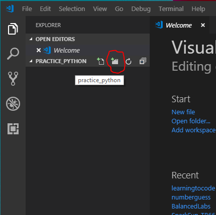
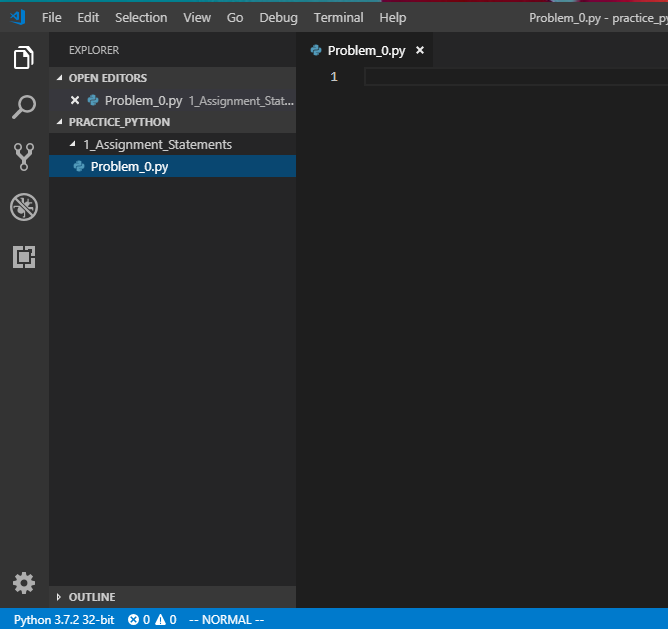
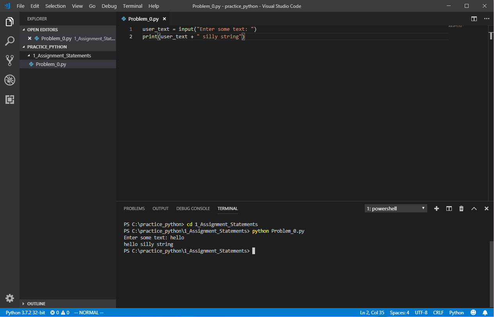

# Getting started
Up to this point we've only been typing `python` to get an interactive prompt. Now we want to write some programs into a file and run them. We'll use our editor and the shell to do this. I'll walk you through the first one line-by-line, then you'll try your hand at a couple of problems yourself.

Open your shell and type the following commands.
```
cd c:\
mkdir practice_python
cd practice_python
code .
```
This will create a directory on your hardrive, step inside and then start the Visual Studio Code editor in that directory. The next time you open the editor just click in the Taskbar and it will remember where you were.

If you look in the pane on the left and hover over the `PRACTICE_PYTHON` name you'll see some icons appear. These let you create folders and files in this directory. We want to create a directory first, click this one.



Name the directory, `1_Assignment_Statements`, create it, then click on it. Now click the icon next to the create folder icon to create a file. Call the file `Problem_0.py`. This will be your first program. Your window should look like this.



You can now type your code in that window (you can close the `Welcome` window).

## Problem 0

To start with we want to take input from the user, append a silly string to it, then print the new string out. Even though we haven't covered functions yet, there are a few built-in functions that will be useful for us now. The first is to get input from the user. Type this into your file:

```python
user_text = input("Enter some text: ")
```
This is an assignment statement where the expression is a function that returns a string. You don't really need to know the details at this point, just recognize that the string you pass to `input` will print on the screen for the user. Once the user types something, then presses enter (very important), your `user_text` variable will hold the string they typed.

Now add a print function call. Your program should now look like this:

```python
user_text = input("Enter some text: ")
print(user_text + " silly string")
```
The `print` function takes whatever string you pass and prints it to the screen. In this case we're taking the string from the user and concatenating `" silly string"` to the end. 

Save your program, and then run it.

To run it, we can open a shell directly in VSCode. Press the `Ctrl` key at the same time as the `` ` `` key to open a shell. You may need to move down into the folder where your program is by typing `cd 1_Assignment_Statements` (`cd` stands for `change directory`).

To run your program, just type `python Problem_0.py`. Here's what your screen should look like:




# Problem 1

Get user input
Write user output

# Problem 2

Temperature conversion

# Problem 3

A logic problem